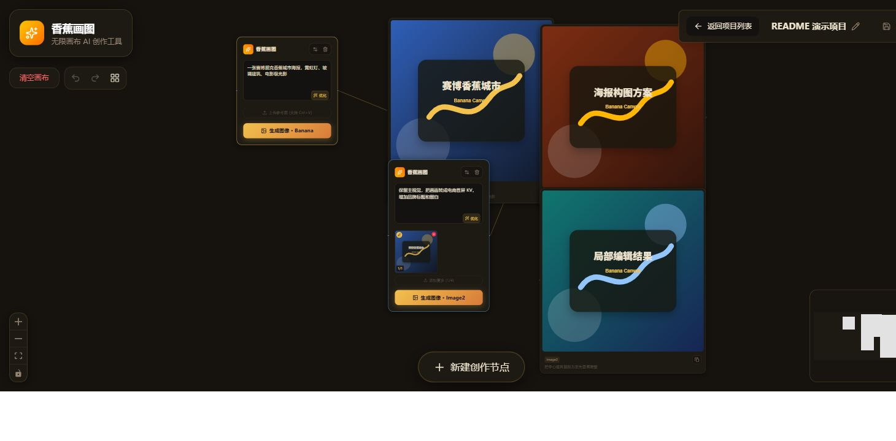
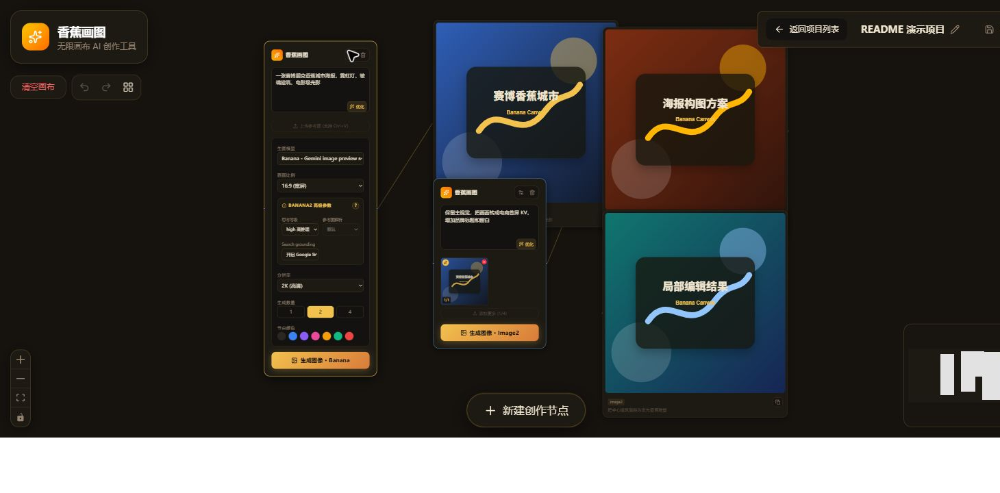
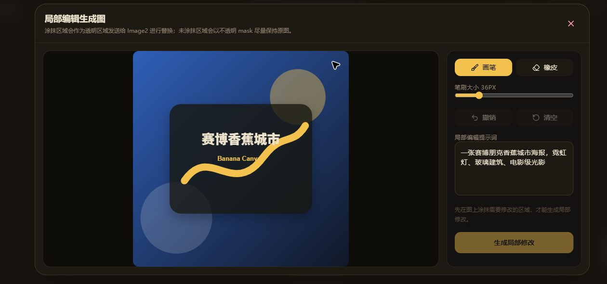

<div align="center">
  
</div>

# AI画伴

当前版本：`0.1.0`

一个类似 Flowith 的无限画布 AI 图像生成工具。你可以在画布上搭建提示词节点和图片节点，把一轮生成的结果继续作为下一轮参考图，逐步迭代出更复杂的视觉方案。

## 项目预览






## 适合场景

- 多轮视觉探索：把满意的生成结果继续作为参考图，逐步收敛风格、构图和细节。
- 海报、KV、角色设定、概念图等方案推演：用画布保留不同分支和中间结果。
- 局部编辑工作流：在已有图片上涂出需要修改的区域，再用 Image2 生成局部变化。
- 本地项目管理：按项目保存画布、节点关系和图片资产，便于回看和继续创作。

## 核心功能

- 无限画布工作流：基于 React Flow 搭建，可在画布上自由摆放、连线、缩放和整理节点。
- 创作节点：输入提示词后可直接生成图片，也可以先用 Gemini 3.1 Pro 优化提示词。
- 图片导入：拖到网页任意位置会在落点创建可操作图片元素；在创作卡内选择文件或使用 `Ctrl+V` / `⌘V` 粘贴时则添加为该卡的参考图。接受 PNG、JPEG、WebP、GIF、SVG、HEIC/HEIF，单次最多 5 张。
- 多参数生图：支持调整画幅比例、输出尺寸、单次生成数量、节点颜色，以及模型专属高级参数。
- 固定 Image2 生图：创作节点不再显示模型选择器，所有新建和旧项目中的创作节点统一使用 `Image2`；历史图片仍保留原本的模型记录。
- 批量生成：单个提示词节点一次可生成 `1`、`2` 或 `4` 张图片，并自动连到新图片节点。
- 图片节点操作：支持全屏查看、复制图片、复制提示词、下载、重新生成，以及“以此为参考新建节点”。
- 画布辅助：支持撤销/重做、适应视口、右键菜单、新建节点、自动布局、清空画布。
- 本地项目持久化：项目索引、画布快照和图片资产默认保存到仓库本地 `data/projects/`；无本地 API 时会回退到 IndexedDB。
- API Key 处理：Image2 默认读取本机 `.env` 中的全局配置并应用于所有项目；Gemini 兼容流程仍可使用请求中提供的自定义 Key。

## 运行环境

- Node.js 20.18.1 或更高版本
- 可用的 Gemini API Key

## 本地启动

1. 安装依赖

```bash
npm install
```

2. 配置 Image2 API

可以在服务器本机打开网页，通过“全局 Image2 API”面板填写接口地址、API Key、模型名称和接口类型。配置会写入本机 `.env`，刷新页面或重启服务后仍然保留，并自动应用于所有现有和新建项目。局域网访问者只能查看连接状态，不能修改本机密钥。

也可以直接在 `.env` 中配置：

```bash
IMAGE2_BASE_URL=https://api.openai.com/v1
IMAGE2_API_KEY=your_api_key
IMAGE2_MODEL=gpt-image-2
IMAGE2_ENDPOINT_TYPE=images
```

`gpt-image-*` 模型使用 `images`；使用 OpenAI-compatible chat completions 中转时设置为 `chat`。

如果你在需要代理的网络环境下访问 image2 中转，也可以额外设置：

```bash
HTTPS_PROXY=http://127.0.0.1:7890
```

或：

```bash
HTTP_PROXY=http://127.0.0.1:7890
```

3. 启动开发服务器

```bash
npm run dev
```

4. 打开浏览器访问：

```text
http://localhost:3000
```

`npm run dev` 会启动 `server.ts`，同时挂载 Express API 和 Vite 中间件，适合本地完整调试。

## 使用方式

1. 点击底部“新建创作节点”，或在画布空白处右键创建新节点。
2. 输入提示词；需要时可上传或粘贴参考图。把 PNG/JPEG/WebP/GIF/SVG/HEIC/HEIF 拖到网页任意位置，会直接创建带操作工具的图片元素。
3. 可先点击“优化”让 Gemini 3.1 Pro 改写提示词，再点击“开始生成”。
4. 生成结果会作为新的图片节点出现在当前节点右侧，并自动建立连线。
5. 悬停图片节点可执行复制、下载、全屏、重新生成、继续作为参考图等操作。
6. 当画布变复杂后，可以使用自动布局和适应视口快速整理结构。

## 快捷键

- `Ctrl+Enter` / `Cmd+Enter`：在当前提示词框内直接生成
- `Ctrl+Z` / `Cmd+Z`：撤销
- `Ctrl+Shift+Z` / `Cmd+Shift+Z`：重做
- `Ctrl+Y`：重做
- `N`：新建创作节点
- `F`：适应当前画布到视口
- `Delete` / `Backspace`：删除已选中的节点

## 参数与行为说明

### 创作节点

- Image2 创作节点支持的画面比例：`1:1`、`4:3`、`16:9`、`3:4`、`9:16`
- 支持的分辨率：`512`、`1K`、`2K`、`4K`；旧项目中的 `512px` 会自动按 `512` 发送
- 支持的批量数量：`1`–`8`，默认 `1`，前端会按所选数量发起独立生成请求
- 参考图上限：5 张；文件、粘贴、外链和画布图片连线入口接受 PNG、JPEG、WebP、GIF、SVG、HEIC/HEIF。GIF、SVG、HEIC/HEIF 会在本地转为兼容 PNG 后用于生图；外链还必须是公网 HTTP/HTTPS，最大 12 MB，读取后会转为本地项目素材
- 生成模型：创作节点固定使用 `.env` 中配置的 `Image2` OpenAI-compatible 接口
- 提示词优化模型：`gemini-3.1-pro-preview`

### 图片节点

- 可复制图片到剪贴板
- 可复制对应提示词
- 可下载为本地 PNG
- 可基于同一提示词重新生成
- 可直接把当前图片转成下一轮创作节点的参考图
- Image2 生成结果会记录请求档位、请求 ID 和接口返回的图片输出 token；中转未返回 `usage` 时会明确显示“token 未返回”

### 本地状态

- 本地开发默认把项目索引、画布快照和图片资产保存到 `data/projects/`。
- 可用 `BANANA_DATA_DIR` 改变本地项目存储目录；相对路径会从项目根目录解析。
- 前端仍使用 `zustand + zundo` 管理画布状态和最多 50 步历史记录。
- 如果 `/api/projects` 不可用，会回退到 IndexedDB，并可在本地 API 可用时迁移旧浏览器项目。
- 未被当前画布或历史引用的图片资产会自动清理，避免无限膨胀。
- 本地文件存储会为图片资产记录 `byteLength` 和 `sha256`，重复保存未变化资产时会复用已有文件；如果同一资产 ID 的内容确实变化，会重新写入。
- `data/` 已被 `.gitignore` 忽略，避免误提交用户本地项目图片。

### 性能与资源注意事项

- 常规项目加载和空画布首屏开销较小；Canvas 代码按路由懒加载。
- 项目自动保存会 debounce，并且不会重复写入未变化的本地图片文件。
- 当前保存接口仍会发送完整画布快照；包含大量大图的项目在节点移动或文本修改时仍可能产生较大的 JSON 请求。后续如果要进一步优化，需要把图片资产上传和画布元数据保存拆成增量协议。
- Image2 局部编辑的画笔移动不会反复扫描整张 mask 画布；大图撤销历史会按约 32 MB 内存预算动态减少帧数，小图最多保留 10 帧。
- 代理和 Image2 runtime 配置支持 `.env` 热重载；旧连接池由运行时 agent 缓存管理，频繁切换代理配置时建议观察连接数和内存。

### Banana2 后端兼容

前端已经隐藏模型选择并固定使用 Image2；以下 Banana2 代码仅为旧数据和后端兼容保留，不再出现在创作节点界面：

- `responseModalities`：固定发送仅 `IMAGE`，因为本项目只消费图片 part。
- `thinkingConfig.thinkingLevel`：发送官方枚举 `MINIMAL`、`LOW`、`MEDIUM`、`HIGH`；复杂文字、构图和多约束任务可提高等级，但会增加延迟。
- `mediaResolution`：控制参考图解析强度，支持 `MEDIA_RESOLUTION_LOW`、`MEDIA_RESOLUTION_MEDIUM`、`MEDIA_RESOLUTION_HIGH`。
- `tools.googleSearch`：可开启 Google Search grounding，让模型使用实时网页/图片搜索信息；通常会增加延迟和成本。
- `safetySettings`：骚扰、仇恨、色情、危险四类默认固定发送 `OFF`，前端不提供调节。
- Banana2 没有 Image2 的 `output_format`、透明背景独立开关、压缩、`partial_images`、mask 参数；透明背景只能通过提示词尝试。
- 服务端会使用 Gemini 返回的 `inlineData.mimeType` 生成 data URL，不再强制按 PNG 处理。

### Image2 高级参数

创作节点固定显示 Image2 中转兼容的高级参数：

- 前端不再开放或发送 `output_format`、`output_compression`、`response_format`、`partial_images` 和 `quality`。画面比例、分辨率与生成数量会被整理为输出要求附加到发给 AI 的提示词中；生成数量仍由网页逐张独立执行，避免模型返回拼图。
- `background` 固定发送 `opaque`，`moderation` 固定发送 `low`，`stream` 固定跟随 `.env` 的 `IMAGE2_STREAM`。
- `output_compression` 只会在 `output_format` 为 `jpeg` 或 `webp` 时发送。
- `gpt-image-2` 不支持 `background=transparent`；前端不提供透明背景选择，旧节点或手写请求也会在发送前丢弃。
- `input_fidelity` 对 `gpt-image-2` 不可调，官方要求省略；模型会自动高保真处理输入图。
- `CLIProxyAPI` 当前会忽略 `n`、`style`、`user`；前端的“生成数量”会用多次请求实现多图。
- `response_format=url` 在 `CLIProxyAPI` 中返回的是 `data URL`，不是官方 60 分钟临时 URL。
- 网页会读取响应中的 `usage.output_tokens`（并兼容常见中转别名），将图片输出 token、接口处理方式和请求 ID 一起保存在图片节点中，刷新项目后仍可查看；历史图片仍保留原来记录的质量档位。
- `file_id` 编辑图不支持；当前项目通过上传、拖放、粘贴、外链或画布连线导入参考图，再走 multipart `image`；mask 局部编辑会把原图和蒙版统一转为同尺寸 PNG。

## 环境变量

| 变量名 | 用途 |
| --- | --- |
| `GEMINI_API_KEY` | 可选，提示词优化及旧版 Banana 兼容流程使用的 API Key |
| `IMAGE2_BASE_URL` | Image2/OpenAI-compatible 中转的基础地址 |
| `IMAGE2_API_KEY` | Image2 接口密钥；不填时可回退到 `GEMINI_API_KEY` |
| `IMAGE2_MODEL` | Image2 模型名称，例如 `gpt-image-2` |
| `IMAGE2_ENDPOINT_TYPE` | 可选，`images` 或 `chat` |
| `IMAGE2_HTTPS_PROXY` | 可选，image2 专用代理；不填时复用 `HTTPS_PROXY` 或 `HTTP_PROXY` |
| `IMAGE2_PROXY_MODE` | 可选，`proxy`、`auto` 或 `direct`；默认 `direct`，避免 image2 relay 被本机代理路径拖慢或 504 |
| `IMAGE2_MAX_ATTEMPTS` | 可选，image2 最大尝试次数，默认 `1`；调大可能产生重复生图成本 |
| `IMAGE2_HEDGE_ENABLED` | 可选，`true` 时在 `IMAGE2_MAX_ATTEMPTS > 1` 下启用 proxy/direct 并发竞速；默认关闭，避免额外 token 消耗 |
| `IMAGE2_STREAM` | 可选，`true` 时 images 接口请求 SSE 流式结果；适合中转有约 60s 空闲网关超时的情况 |
| `IMAGE2_PARTIAL_IMAGES` | 可选，流式 images 请求的局部图数量，范围 `0`-`3`；大于 `0` 更容易保持连接活跃，但可能增加 image token 成本 |
| `IMAGE2_REQUEST_TIMEOUT_MS` | 可选，image2 单次请求超时，默认 `240000` |
| `IMAGE2_RETRY_DELAY_MS` | 可选，image2 两次尝试之间的等待时间，默认 `1000` |
| `IMAGE2_PROXY_CONNECT_TIMEOUT_MS` | 可选，image2 代理建连超时，默认 `60000` |
| `IMAGE2_DIRECT_CONNECT_TIMEOUT_MS` | 可选，image2 直连建连超时，默认 `60000` |
| `IMAGE2_DIRECT_ALLOW_H2` | 可选，是否允许 image2 直连 HTTP/2，默认 `true` |
| `PORT` | 可选，服务端监听端口，默认 `3000`；启动期配置，修改后需重启 |
| `NODE_ENV` | 可选，`production` 时使用静态构建产物；启动期配置，修改后需重启 |
| `BANANA_DATA_DIR` | 可选，本地项目文件存储目录，默认 `./data`；启动期配置，修改后需重启 |
| `HTTPS_PROXY` | 可选，为 image2 服务端请求配置 HTTPS 代理 |
| `HTTP_PROXY` | 可选，为 image2 服务端请求配置 HTTP 代理 |
除 `PORT`、`NODE_ENV`、`BANANA_DATA_DIR` 外，上表中的服务端网络参数会从 `.env` 热更新。URL、整数、布尔值和枚举值会在初始加载和每次 reload 时统一校验。用户的接口地址、Key、模型和接口类型不属于服务端环境变量。

## 可用脚本

| 命令 | 说明 |
| --- | --- |
| `npm run dev` | 启动 Express + Vite 开发环境，包含图像生成和提示词优化接口 |
| `npm run build` | 构建前端静态资源到 `dist/` |
| `npm run lint` | 运行 TypeScript 类型检查 |
| `npm test` | 运行全部 `src/**/*.test.ts` 和 `src/**/*.test.tsx` 测试 |
| `npm run check` | 依次运行类型检查、测试和构建 |
| `npm run preview` | 仅预览 Vite 构建产物，不包含 Express API |
| `npm run clean` | 删除 `dist/` 目录 |

## 主要目录

```text
.
├─ src/
│  ├─ components/
│  │  ├─ Canvas.tsx                # 画布、右键菜单、快捷键、自动布局
│  │  ├─ ApiKeyCheck.tsx           # API Key 检测与手动录入
│  │  ├─ nodes/
│  │  │  ├─ PromptNode.tsx         # 提示词节点
│  │  │  ├─ ImageNode.tsx          # 图片节点
│  │  │  ├─ generationPromptRequirements.ts # 将生成选项整理进 AI 提示词
│  │  │  ├─ BananaOptionsPanel.tsx # Banana2 高级参数面板
│  │  │  ├─ GeneratingImagePlaceholder.tsx # 生成中过渡卡片
│  │  │  ├─ PromptTextarea.tsx     # 文本框与 Ctrl/Cmd+Enter 提交
│  │  │  ├─ useReferenceImages.ts  # 参考图解析、上传/粘贴与上限控制
│  │  │  ├─ usePromptGeneration.ts # 提示词节点生成流程
│  │  │  ├─ useImageNodeActions.ts # 图片节点复制、下载、重跑与参考节点动作
│  │  │  └─ useMaskGeneration.ts   # Image2 局部编辑共享请求逻辑
│  │  ├─ mask/                     # Image2 蒙版编辑与对比弹窗
│  │  ├─ projects/                 # 项目列表、缺失项目状态
│  │  └─ edges/
│  │     └─ DeletableEdge.tsx      # 可悬停删除的边
│  ├─ pages/                       # 项目列表页与项目画布页
│  ├─ server/
│  │  ├─ app.ts                    # Express app factory and API route mounting
│  │  ├─ projectsRoutes.ts         # 本地项目 CRUD/import API
│  │  ├─ generationRoutes.ts       # 生图与提示词优化 API
│  │  ├─ requestValidation.ts      # 生图请求校验与规范化
│  │  ├─ proxy.ts                  # 代理、undici agent 与 fetch 包装
│  │  ├─ runtimeConfig.ts          # .env 热重载、运行时配置和校验
│  │  ├─ runtimeProxy.ts           # 运行时代理配置同步
│  │  └─ providers/                # Banana 与 Image2 provider 调用
│  ├─ services/gemini.ts           # 前端调用后端接口
│  ├─ store.ts                     # 画布状态和历史记录
│  └─ lib/                         # 模型参数、项目存储、资产归档、路由等
├─ server.ts                       # 环境加载、Vite/static 中间件和监听入口
├─ metadata.json                   # 应用元数据
└─ .env.example                    # 示例环境变量
```

## 测试

当前仓库包含项目路由、本地文件存储、IndexedDB 回退、画布资产归档、模型参数、节点组件、mask 编辑和前端 payload 测试。推荐执行全量测试：

```bash
npm test
```

`npm install` 是首次设置步骤，用于安装依赖。`npm run check` 不会执行 `npm install`，它只会按顺序运行 `npm run lint`、`npm test` 和 `npm run build`。

## 当前架构概览

- 前端：React 19 + Vite + Tailwind CSS 4 + React Flow
- 状态：Zustand + Zundo
- 持久化：本地 Express 文件存储；无本地 API 时回退 IndexedDB
- 后端：Express
- AI SDK：`@google/genai`

前端通过 `/api/projects` 读写本地项目，通过 `/api/generate-image` 和 `/api/optimize-prompt` 调用后端，再由后端统一请求 Gemini 或 Image2 中转。这样前端交互、项目存储和模型调用可以保持清晰分层。
